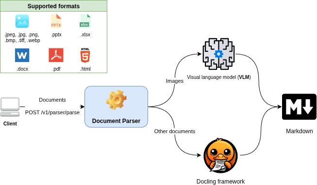

# Document Parser

## 1. Overview

Service is designed for parsing documents to single `Markdown` format, using VLM and [Docling framework](https://docling-project.github.io/docling/)



Figure 1. Context schema of service

### Allowed formats

| **Images** | **Documents** | **Presentation** | **XLSX** | **PDF** | **TXT** |
|:----------:|:-------------:|:----------------:|:--------:|:-------:|:-------:|
|    .png    |     .docx     |       .pptx      |   .xlsx  |   .pdf  | .txt    |
|    .jpeg   |               |                  |          |         |         |
|    .jpg    |               |                  |          |         |         |
|    .bmp    |               |                 	|          |         |         |
|    .tiff   |               |                  |          |         |         |
|    .webp   |               |                  |          |         |         |

## 2. Installing and launching

### Requirements:

 1. `Python 3.12`
 2. `Docker`
 3. ❗❗❗ Access to `VLM` for Image parsing (**external** or **self-hosted** `VLM`).
 4. `Poetry`

### Environments

 * `SERVICE_NAME`- the name of service, e.g. `document-parser`
 * `HOST` - service hosting IP, e.g. `0.0.0.0`
 * `PORT` - service hosting PORT, e.g. `1338`
 * `VLM_BASE_URL` - VLM API URL, e.g. `0.0.0.0:8000`
 * `VLM_MODEL_NAME` - VLM model name, e.g. `Qwen2.5-VL`,
 * `VLM_API_KEY` - API-KEY auth for model, e.g. `no-key-required`

❗❗❗ Download Docling models in root dir `ml` using:
`docling-tools models download --all -o ml`

### Manual startup

 1. `poetry shell`
 2. `poetry install`
 3. `cd app`
 4. `python main.py`

 `Swagger` available on `http://{HOST}:{PORT}/docs`

### Building with docker

 1. In the root directory command: `docker build -t document-parser:latest .`

## 3. Business-logic

Parser factory consists of **5** parser types, which having own processing algorithms, based on **Docling** and **VLM**:
 * `ImageParser`
 * `DocParser`
 * `PPTXParser`
 * `XLSXParser`
 * `PDFParser`


Figure 2. Parser class overview

### API

#### 1. Parsing documents
```rust
POST /v1/parser/parse?parse_images=false&include_image_in_output=false
```
Query params:
 1. `parse_images` - parse internal document images with VLM (need access to VLM, may take more time)
 2. `include_image_in_output` - inject internal document images to output `Markdown` as `base64` (may increase output size)

 
 

