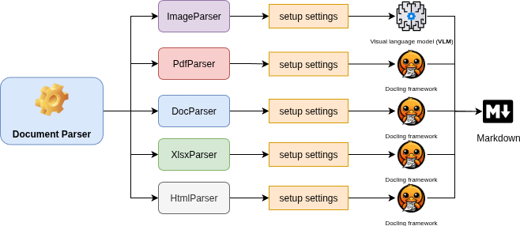
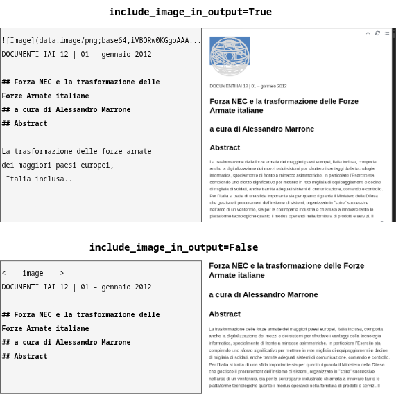
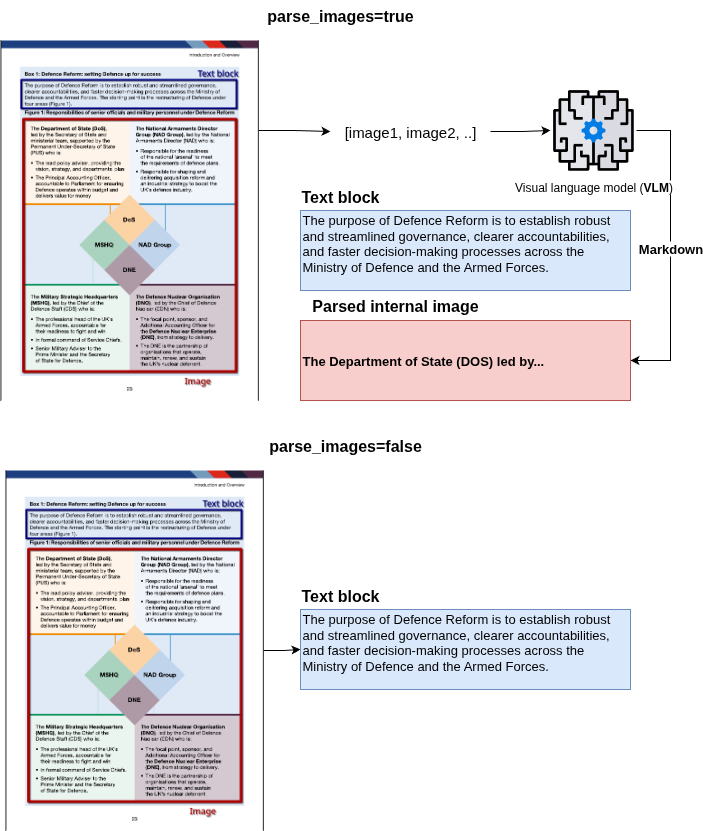

# Document Parser

Сервис преобразует документы в Markdown и Word, а также умеет переводить содержимое документов через внешние сервисы. В основе парсинга используются `Docling`, `pypandoc`, `LibreOffice` и VLM для OCR по изображениям и сложным PDF.


## Что умеет сервис

- Парсить документы в Markdown-текст.
- Возвращать результат как `.md` или `.docx`.
- Переводить документ синхронно через `translator v1`.
- Запускать асинхронный перевод с прогрессом через `translator v2`.

Поддерживаемые форматы:

| Изображения | Документы | Презентации | Таблицы | PDF | Текст |
|:-----------:|:---------:|:-----------:|:-------:|:---:|:-----:|
| `.png` | `.docx` | `.pptx` | `.xlsx` | `.pdf` | `.txt` |
| `.jpeg` | `.odt` | `.odp` | `.ods` |  |  |
| `.jpg` | `.doc` |  |  |  |  |
| `.bmp` |  |  |  |  |  |
| `.tiff` |  |  |  |  |  |
| `.webp` |  |  |  |  |  |

## Архитектура и поток данных

Сервис состоит из нескольких прикладных модулей:

- `parser v1` принимает файл и превращает его в Markdown, `.md`, `.docx` или `DoclingDocument`.
- `translator v1` работает синхронно: парсит документ, переводит текст и возвращает результат в том же HTTP-запросе.
- `translator v2` работает асинхронно: создаёт задачу, публикует прогресс в `webhook_manager`, складывает оригинал и результат в `watchtower` и возвращает `task_id`.
- `resource_manager` сообщает, в какой пользовательский bucket нужно складывать файлы.
- `watchtower` отвечает за upload и share-ссылки.

Дополнительные схемы и runbooks:

- [Архитектура](./docs/architecture.md)
- [Интеграции](./docs/integration.md)
- [Эксплуатация и диагностика](./docs/operations.md)

## Внешние зависимости

Для полноценной работы сервис зависит от внешней инфраструктуры:

- VLM-сервис для OCR по изображениям и full-VLM-парсинга PDF.
- Текстовый переводчик.
- Детектор языка.
- `webhook_manager` для хранения статусов асинхронных задач.
- `watchtower` для загрузки файлов и выдачи share-ссылок.
- `resource_manager` для поиска пользовательского bucket.

Без этих сервисов часть сценариев будет недоступна. Например, `translator v2` не сможет завершить задачу без `webhook_manager`, `watchtower` и `resource_manager`.

## Быстрый старт для разработчика

### Требования

- `Python 3.12`
- `Poetry`
- `Docker`
- `LibreOffice`
- `pandoc`
- Доступ к VLM, если нужен OCR по изображениям

### Переменные окружения

Минимально важные переменные:

- `SERVICE_NAME` — имя сервиса, участвует в ключах задач.
- `HOST`, `PORT` — адрес и порт FastAPI.
- `ML_DIR` — каталог локальных моделей Docling.
- `PARSER_WORKERS` — количество процессов для CPU-bound парсинга.
- `VLM_BASE_URL`, `VLM_MODEL_NAME`, `VLM_API_KEY`, `VLM_MAX_TOKENS`, `VLM_TIMEOUT_SECS` — настройки VLM.
- `TRANSLATOR_ADDRESS`, `TRANSLATE_URI` — адрес сервиса перевода.
- `DETECT_LANGUAGE_URL` — адрес сервиса определения языка.
- `WEBHOOK_MANAGER_URL`, `WATCHTOWER_URL`, `WATCHTOWER_SHARED_HOST`, `RESOURCE_MANAGER_URL` — интеграционные сервисы.
- `TRANSALTOR_MAX_CONCURRENCY` — ограничение параллельных запросов к переводчику.

Пример запуска по умолчанию использует `.env.dev`. Для production-сценария можно задать `ENV_FILE=/path/to/.env.production`.

### Локальный запуск

1. Установить зависимости:

```bash
poetry install
```

2. Скачать модели Docling в каталог `ml`:

```bash
docling-tools models download --all -o ml
```

3. Перейти в каталог приложения и запустить сервис:

```bash
cd app
poetry run python main.py
```

4. Открыть Swagger:

```text
http://{HOST}:{PORT}/docs
```

## Docker

Сборка образа:

```bash
docker build -t document-parser:latest .
```

В репозитории есть `docker-compose.yaml`, но перед использованием его стоит привести к современному формату `services:`. Каталог `ml` ожидается как volume и не должен запекаться в образ.

## Какой API использовать

### `parser v1`

Используйте, когда нужно только распознать документ и сразу получить результат.

- `POST /api/v1/parser/parse/text`
- `POST /api/v1/parser/parse/file`
- `POST /api/v1/parser/parse/file/word`

### `translator v1`

Используйте, когда нужен синхронный перевод в одном запросе и размер документа умеренный.

- `POST /api/v1/parser/translator/text`
- `POST /api/v1/parser/translator/file`
- `POST /api/v1/parser/translator/file/word`

### `translator v2`

Используйте, когда нужен асинхронный перевод с прогрессом и выгрузкой файлов в облачное хранилище.

- `POST /api/v2/parser/translator/file/word`

Ответ сразу содержит:

- `task_id` — идентификатор задачи.
- `key` — ключ вида `user_id:service:task_id`.

Дальше прогресс и ссылки на файлы обновляются через `webhook_manager`.

## Типовые проблемы

- Swagger открывается, но OCR не работает: проверьте `VLM_BASE_URL`, `VLM_MODEL_NAME` и доступность VLM.
- Асинхронная задача создаётся, но зависает: проверьте доступность `webhook_manager`.
- Файл не загружается после перевода: проверьте `resource_manager`, bucket пользователя и доступность `watchtower`.
- `full_vlm_pdf_parse` работает медленно: это ожидаемо, потому что весь PDF обрабатывается через VLM.
- Формат отклоняется на входе: проверьте MIME type, а не только расширение файла.

## Дополнительные материалы






