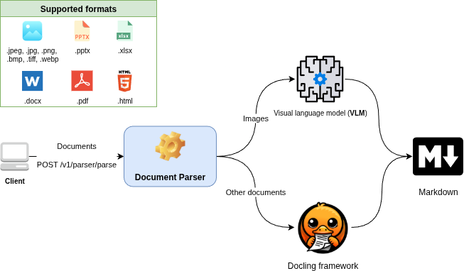

# Document Parser

> FastAPI + Docling + VLM (Optional) app

## 1. Overview



## Что умеет сервис

- Парсить документы в Markdown-текст.
- Возвращать результат как `.md` или `.docx`.
- Переводить документ синхронно через `translator v1`.
- Запускать асинхронный перевод с прогрессом через `translator v2`.

Поддерживаемые форматы:

| **Images** | **Documents** | **Presentation** | **XLSX** | **PDF** | **TXT** |
| :--------------: | :-----------------: | :--------------------: | :------------: | :-----------: | :-----------: |
|       .png       |        .docx        |         .pptx         |     .xlsx     |     .pdf     |     .txt     |
|      .jpeg      |                    |                        |                |              |              |
|       .jpg       |                    |                        |                |              |              |
|       .bmp       |                    |                        |                |              |              |
|      .tiff      |                    |                        |                |              |              |
|      .webp      |                    |                        |                |              |              |

## Архитектура и поток данных

Сервис состоит из нескольких прикладных модулей:

1. `Python 3.12`
2. `Docker`
3. ❗❗❗ Access to `VLM` for Image parsing (**external** or **self-hosted** `VLM`).
4. `Poetry`

❗❗❗ Download Docling models in root dir `ml` using:
`docling-tools models download --all -o ml` this will be yours volume of `docker`

Дополнительные схемы и runbooks:

* `SERVICE_NAME`- the name of service, e.g. `document-parser`
* `HOST` - service hosting IP, e.g. `0.0.0.0`
* `PORT` - service hosting PORT, e.g. `1338`
* `VLM_BASE_URL` - VLM API URL, e.g. `0.0.0.0:8000`
* `VLM_MODEL_NAME` - VLM model name, e.g. `Qwen2.5-VL`,
* `VLM_API_KEY` - API-KEY auth for model, e.g. `no-key-required`

## Внешние зависимости

Для полноценной работы сервис зависит от внешней инфраструктуры:

1. `poetry shell`
2. `poetry install --no-root`
3. `docling-tools models download --all -o ml`
4. `cd app`
5. `python main.py`

Без этих сервисов часть сценариев будет недоступна. Например, `translator v2` не сможет завершить задачу без `webhook_manager`, `watchtower` и `resource_manager`.

## Быстрый старт для разработчика

1. In the root directory command: `docker build -t document-parser:latest .`
2. Be sure, that you have ml models in dir `ml` as a volume in `docker`

- `Python 3.12`
- `Poetry`
- `Docker`
- `LibreOffice`
- `pandoc`
- Доступ к VLM, если нужен OCR по изображениям

Parser factory consists of **5** parser types, which having own processing algorithms, based on **Docling** and **VLM**:

* `ImageParser`
* `DocParser`
* `PPTXParser`
* `XLSXParser`
* `PDFParser`

Минимально важные переменные:

- `SERVICE_NAME` — имя сервиса, участвует в ключах задач.
- `HOST`, `PORT` — адрес и порт FastAPI.
- `ML_DIR` — каталог локальных моделей Docling.
- `PARSER_WORKERS` — количество процессов для CPU-bound парсинга.
- `VLM_BASE_URL`, `VLM_MODEL_NAME`, `VLM_API_KEY`, `VLM_MAX_TOKENS`, `VLM_TIMEOUT_SECS` — настройки VLM.
- `TRANSLATOR_ADDRESS`, `TRANSLATE_URI` — адрес сервиса перевода.
- `DETECT_LANGUAGE_URL` — адрес сервиса определения языка.
- `WEBHOOK_MANAGER_URL`, `WATCHTOWER_URL`, `WATCHTOWER_SHARED_HOST`, `RESOURCE_MANAGER_URL` — интеграционные сервисы.
- `TRANSALTOR_MAX_CONCURRENCY` — ограничение параллельных запросов к переводчику.

Пример запуска по умолчанию использует `.env.dev`. Для production-сценария можно задать `ENV_FILE=/path/to/.env.production`.

#### 1. Parsing documents

```rust
POST /v1/parser/parse?parse_images=false&include_image_in_output=false
```

Query params:

1. `parse_images` - parse internal document images with VLM (need access to VLM, may take more time)
2. `include_image_in_output` - inject internal document images to output `Markdown` as `base64` (may increase output size)

 
 
