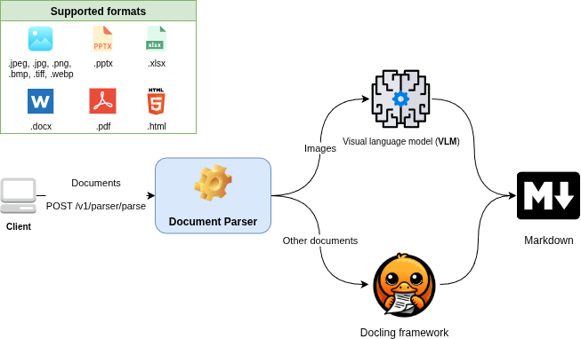

# Document Parser

> FastAPI + Docling + VLM: парсинг документов в Markdown/Word и перевод —
> синхронно по HTTP и асинхронно через очередь.



## Что умеет сервис

- Парсить документы в Markdown-текст, `.md` и `.docx`.
- Распознавать текст на изображениях и «сложных» PDF через внешнюю VLM.
- Переводить документ синхронно (`Translator V1`) — результат в ответе на тот
  же запрос.
- Переводить асинхронно — задачу ставит клиент через `task_gateway`, сервис
  забирает её из RabbitMQ, а прогресс и файлы отдаёт через `webhook_manager` и
  облачное хранилище пользователя. См. [«Режим очереди»](#режим-очереди-rabbitmq).

Поддерживаемые форматы (`FileFormats` в `parser/v1/schemas.py`):

| Группа | Расширения |
| --- | --- |
| Изображения | `.jpg` `.jpeg` `.png` `.tiff` `.bmp` `.webp` |
| Документы | `.docx` `.doc` `.rtf` |
| OpenDocument | `.odt` `.ott` `.ods` `.ots` `.odp` `.otp` |
| Презентации | `.pptx` |
| Таблицы | `.xlsx` |
| PDF | `.pdf` |
| Текст и разметка | `.txt` `.text` `.md` `.qmd` `.Rmd` `.rmd` `.html` |
| Прочее | `.epub` `.eml` `.xbrl` `.xml` |

Парсер выбирается **по расширению** файла, а не по MIME: `ALLOWED_MIME_TYPES`
содержит `application/octet-stream` и почти ничего не отсекает.

## API

Полная документация с примерами — `GET /docs` у запущенного сервиса.

| Метод | Путь | Результат |
| --- | --- | --- |
| `POST` | `/api/v1/parser/parse/text` | Markdown-строка в JSON |
| `POST` | `/api/v1/parser/parse/file` | Файл `.md` |
| `POST` | `/api/v1/parser/parse/file/word` | Файл `.docx` |
| `POST` | `/api/v1/parser/translator/text` | Переведённый Markdown в JSON |
| `POST` | `/api/v1/parser/translator/file` | Переведённый `.md` |
| `POST` | `/api/v1/parser/translator/file/word` | Переведённый `.docx` |
| `GET` | `/api/v1/contract` | Контракт публикации задач в очередь, JSON со схемами |
| `GET` | `/api/v1/contract.md` | То же одним Markdown-документом |
| `GET` | `/health` | Готовность сервиса и состояние консюмера |
| `GET` | `/` | Ссылка на документацию |

Запрос — `multipart/form-data`. Общие поля:

- `file` — сам документ;
- `parse_images` — OCR по встроенным изображениям через VLM (дольше, нужен доступ к VLM);
- `include_image_in_output` — вшить изображения в Markdown как base64 (сильно раздувает ответ);
- `full_vlm_pdf_parse` — целиком отдать PDF в VLM вместо разбора Docling;
- `source_language`, `target_language` — только у переводчиков; `auto` включает
  определение языка через `DETECT_LANGUAGE_URL`.


Асинхронного HTTP-эндпоинта у сервиса нет: длинные задачи ставятся только
через очередь — см. [«Режим очереди»](#режим-очереди-rabbitmq).

## Требования

- Python 3.12 или 3.13
- Poetry
- LibreOffice (`soffice`) — конвертация `.doc`, `.rtf`
- pandoc — любой экспорт в Word
- Docker — для сборки образа и локальных стендов
- Доступ к VLM с OpenAI-совместимым API — если нужен OCR по изображениям

Модели Docling скачиваются один раз в каталог `ml/` (в git не хранится, в
контейнер монтируется томом):

```bash
docling-tools models download --all -o ml
```

## Быстрый старт

```bash
poetry install --no-root
docling-tools models download --all -o ml
cp .env.example .env.dev          # и поправить адреса под свой контур
PYTHONPATH=app python3 app/main.py
```

Импорты в коде абсолютные от каталога `app` (`from modules...`,
`from settings import settings`), поэтому `PYTHONPATH=app` обязателен и при
запуске, и при тестах. Альтернатива — `cd app && python main.py`.

В Docker:

```bash
docker build -t document-parser:latest .
```

`docker-compose.yaml` в корне — это описание одного сервиса **без**
верхнеуровневого ключа `services:`: как есть он не запускается, его блок
вставляют в compose контура. Чтобы поднять локально, добавьте `services:`
первой строкой. Образу нужны `.env.production` и том с моделями `./ml`.

Тесты (pytest в окружении нет, всё на `unittest`):

```bash
PYTHONPATH=app python3 -m unittest discover -s tests -t tests
```

## Конфигурация

Настройки читаются pydantic-settings из файла, указанного в `ENV_FILE`; по
умолчанию это `.env.dev`. Шаблон со всеми переменными — `.env.example`.

| Группа | Переменные |
| --- | --- |
| Базовые | `SERVICE_NAME` (участвует в ключах задач), `HOST`, `PORT`, `PRODUCTION_MODE`, `ML_DIR` |
| Парсинг | `PARSER_WORKERS` — число процессов под CPU-bound Docling; в контейнере задавайте явно, по умолчанию берётся число ядер хоста |
| VLM | `VLM_BASE_URL`, `VLM_MODEL_NAME`, `VLM_API_KEY`, `VLM_MAX_TOKENS`, `VLM_TIMEOUT_SECS` |
| Перевод | `TRANSLATOR_ADDRESS`, `TRANSLATE_URI`, `TRANSLATOR_MAX_CONCURRENCY`, `DETECT_LANGUAGE_URL` |
| Интеграции | `WEBHOOK_MANAGER_URL`, `WATCHTOWER_URL`, `RESOURCE_MANAGER_URL` |
| Таймауты | `TASK_TIMEOUT_SECS` (вся задача перевода), `PARSE_TIMEOUT_SECS`, `SOFFICE_TIMEOUT_SECS`, `POST_REQUEST_TIMEOUT`, `EXTERNAL_*` |
| Очередь | `BROKER_ENABLED` и весь блок `RMQ_*` — см. [«Режим очереди»](#режим-очереди-rabbitmq) |
| Наблюдаемость | `OTEL_*`, `METRICS_HTTP_*` — см. [`metrics/README.md`](metrics/README.md) |

Историческая опечатка: поле называется `TRANSALTOR_MAX_CONCURRENCY`, но env
читается по обоим написаниям, а в коде есть property
`settings.TRANSLATOR_MAX_CONCURRENCY`.

## Режим очереди (RabbitMQ)

Кроме HTTP сервис умеет брать задачи из очереди. Оба входа ведут в один и тот же
конвейер перевода — различается только источник файла и то, кто создаёт задачу.

Включается флагом, один и тот же образ работает в двух ролях:

```dotenv
BROKER_ENABLED=true      # в деплойменте воркера
BROKER_ENABLED=false     # в деплойменте API
```

Формат сообщения:

```json
{
  "task_id": "5fb0b68c-2259-47d8-8e72-3dc517ac6d4d",
  "user_id": "1234",
  "task_type": "document-parser.translate",
  "payload": {
    "file_path": "documents/report.pdf",
    "source_language": "auto",
    "target_language": "ru"
  }
}
```

`file_path` — object key внутри бакета пользователя. Бакет в сообщении не
передаётся: он всегда определяется по `user_id` через `resource_manager`, иначе
продюсер мог бы записать файл в чужое хранилище. Файл скачивается из
`watchtower`, результат кладётся туда же, в `output_prefix`.
Прогресс и итог публикуются в `webhook_manager` по ключу
`{user_id}:{SERVICE_NAME}:{task_id}`, в очередь ответ не пишется.

### Контракт для клиента

Клиент в очередь не публикует: он ставит задачу через `task_gateway`
(`POST /api/v1/broker/publish` с `task_type` и `payload`), а тот сам заводит
запись задачи и кладёт сообщение в брокер. Чтобы команде-интегратору не читать
этот README и код, сервис описывает себя сам:

```bash
curl -s http://document-parser:1338/api/v1/contract.md > document-parser-contract.md
```

Документ содержит: что должно быть готово до постановки (файл в бакете), как
поставить задачу через гейтвей, поля `payload` с типами и значениями по
умолчанию и правилами заполнения, как читать прогресс и результат из
`webhook_manager`, как отменить, что сервис делает при сбоях сам, лимиты,
поддерживаемые форматы и чек-лист. Механика очереди вынесена в приложение —
клиенту она не нужна. JSON-версия с JSON Schema — `GET /api/v1/contract`.

Контракт **генерируется** из pydantic-моделей конверта и payload, реестра
обработчиков и настроек того пода, у которого его запросили. Поэтому он не
устаревает и показывает реальные имена exchange и очереди, лимиты и таймауты
конкретного окружения. Новый `task_type` попадает в документацию сам — за этим
следит тест.

### Что важно знать про топологию

- **Exchange и рабочую очередь сервис не создаёт** — их владелец `task_gateway`.
  Если их нет, воркер осознанно падает на старте с явным сообщением.
- Свои `document-parser.dlx`, `document-parser.dlq` и `document-parser.retry`
  сервис объявляет сам.
- У рабочей очереди нет DLX, поэтому копии сообщений в DLQ **публикует сам
  сервис**. Отсюда следствие для эксплуатации: DLQ наполняется только работающим
  подом, и её непустота — сигнал о невыполненных задачах. Сервис проверяет её
  раз в `RMQ_DLQ_CHECK_INTERVAL_SECS` и пишет в лог, `GET /health` отдаёт
  глубину в поле `broker.dlq_depth`, а на дашборде это отдельная панель с
  алертом.
- Временный сбой уходит в retry-очередь с TTL `RMQ_RETRY_DELAY_SECS` и
  возвращается в работу; после `RMQ_MAX_RETRIES` попыток сообщение едет в DLQ.
  Если retry-очередь недоступна, повтор деградирует в `nack(requeue)` без
  счётчика попыток — это видно в логе и в метрике `broker.topology.ready`.

### `consumer_timeout`

Брокер по умолчанию разрывает канал, если сообщение не подтверждено за 30 минут,
а перевод большого документа идёт дольше. На брокере должно стоять
`consumer_timeout = 3600000` (60 минут), в сервисе — `TASK_TIMEOUT_SECS=3000`
(50 минут) и `RMQ_ACK_DEADLINE_SECS=3600`. Готовый конфиг —
`deploy/rabbitmq/rabbitmq.conf`. Расхождение сервис проверяет на старте и пишет
предупреждение в лог.

### Локальная разработка

```bash
docker compose -f docker-compose.dev.yaml up -d     # брокер с нужным consumer_timeout
BROKER_ENABLED=true PYTHONPATH=app python3 app/main.py
```

Management UI — http://localhost:15672 (guest/guest). Команды для создания
«гейтвейной» топологии вручную — в шапке `docker-compose.dev.yaml`.

### Проверка состояния

```bash
curl -s localhost:1338/health | jq
```

`GET /health` отдаёт **503**, если консюмер включён, но не потребляет: под,
который молча не разбирает очередь, для оркестратора должен выглядеть больным.

⚠️ Это **readiness**, а не liveness. На время переподключения к брокеру ручка
отдаёт 503 на секунду-две. Повесив её на liveness-пробу, вы получите
перезапуск пода с 50-минутным переводом из-за секундного сетевого блипа.

## Мониторинг (OTLP + Grafana)

Сервис отдаёт метрики и трейсы по OpenTelemetry: push по OTLP/HTTP в коллектор
и, параллельно, Prometheus-эндпоинт на отдельном порту. По умолчанию всё
выключено (`OTEL_ENABLED=false`) и не стоит ничего.

```bash
docker compose -f metrics/docker-compose.observability.yaml up -d
OTEL_ENABLED=true PYTHONPATH=app python3 app/main.py
```

- дашборд «Document Parser» — <http://localhost:3000/d/document-parser/document-parser>;
- Prometheus и алерты — <http://localhost:9090/alerts>;
- трейсы — в Grafana: Explore → Tempo;
- сырые метрики сервиса — <http://localhost:9464/metrics>.

Видно: исходы и длительность сообщений очереди, глубину DLQ и состояние
подписки, статусы и этапы задач перевода, вызовы внешних сервисов, свой
HTTP-API, загрузку семафоров и пересборки пула процессов.

Подключение к коллектору контура — одна переменная:

```dotenv
OTEL_ENABLED=true
OTEL_EXPORTER_OTLP_ENDPOINT=http://otel-collector.observability:4318
```

Если Grafana и Prometheus в контуре уже есть, локальный стенд не нужен:
достаточно импортировать `metrics/grafana/dashboards/document-parser.json` и
добавить цель скрейпа. Полное описание метрик, алертов и вариантов
подключения — в [`metrics/README.md`](metrics/README.md).

## Куда смотреть дальше

| Файл | О чём |
| --- | --- |
| [`AGENTS (Document Parser).md`](AGENTS%20%28Document%20Parser%29.md) | Карта репозитория: модули, поток запроса, инварианты |
| [`app/modules/translator/v2/AGENTS.md`](app/modules/translator/v2/AGENTS.md) | Детали асинхронного перевода и отмены задач |
| [`docs/rabbitmq-integration.md`](docs/rabbitmq-integration.md) | Архитектура интеграции с очередью |
| [`metrics/README.md`](metrics/README.md) | Метрики, трейсы, дашборд, алерты |
| `docs/*.drawio.png` | Схемы контекста и логики парсера |
